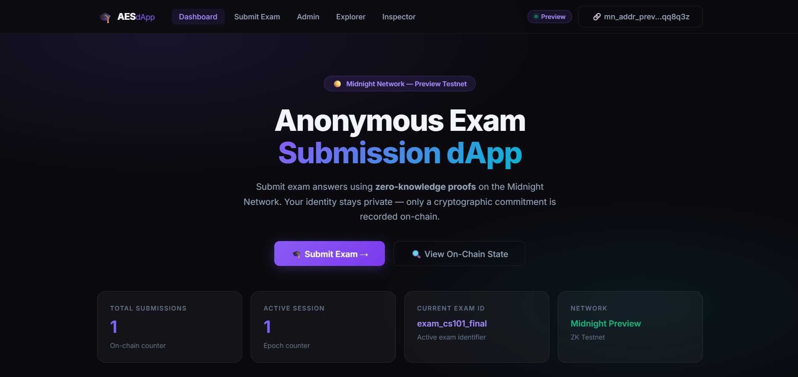

# Private Investment Verification (PIV)
> A privacy-preserving zero-knowledge accredited investor verification & private placement capital commitment dApp built on the Midnight Network using Compact smart contracts.

[](https://github.com/biltujana/Private-Investment-Verification)
[](https://private-investment-verification.vercel.app/)
[](https://github.com/biltujana/Private-Investment-Verification/actions/workflows/ci.yml)
[](https://preview.midnightexplorer.com/contracts/0x5292a220155624990f23cff1d979fe66137264e240982a2a32901b8060951d6a)
[](https://midnight.network)
[](https://nextjs.org)
[](https://nodejs.org)
[](LICENSE)

---

## 🎯 What Is PIV?

**Private Investment Verification (PIV)** enables high-net-worth investors, family offices, and angel syndicates to prove regulatory accredited investor qualifications and net worth requirements ($1,000,000+ USD) **without disclosing their bank account balances, tax returns, brokerage statements, or personal identity** to fund managers, broker-dealers, or public observers. Built on Midnight Network's Compact zero-knowledge smart contracts, investors generate cryptographic ZK proofs locally on their own device. Only a one-way accreditation commitment hash is published on-chain — eliminating financial identity theft, centralized document leaks, and regulatory compliance friction.

> **Verify accredited investor status & commit capital mathematically — without exposing personal balance sheets, tax returns, or investor identity.**

---

## 🏗️ Repository & Deployment

- 📄 **Project Proposal**: [PROPOSAL.md](PROPOSAL.md)
- 📦 **GitHub Repository**: [https://github.com/biltujana/Private-Investment-Verification](https://github.com/biltujana/Private-Investment-Verification)
- 🚀 **Vercel Live Demo**: [https://private-investment-verification.vercel.app/](https://private-investment-verification.vercel.app/)
- ⚙️ **CI/CD Workflow**: [.github/workflows/ci.yml](.github/workflows/ci.yml)
- 🌐 **Midnight Explorer**: [https://preview.midnightexplorer.com/contracts/0x5292a220155624990f23cff1d979fe66137264e240982a2a32901b8060951d6a](https://preview.midnightexplorer.com/contracts/0x5292a220155624990f23cff1d979fe66137264e240982a2a32901b8060951d6a)
- 📡 **Network**: Midnight Preview Testnet
- 🔑 **Contract Address**: `0x5292a220155624990f23cff1d979fe66137264e240982a2a32901b8060951d6a` ✅ **CONFIRMED**
- 🌐 **Preview Node RPC**: `https://rpc.preview.midnight.network`
- 📊 **Preview Indexer**: `https://indexer.preview.midnight.network/api/v4/graphql`
- 💧 **Preview Faucet**: `https://faucet.preview.midnight.network`
- 💡 **Vercel Note**: No `.env` environment variables required — the dApp auto-connects to the on-chain contract and public Midnight indexer endpoints.

---

## 📸 Platform Screenshots & Verification

### 1. Main Dashboard & ZK Contract Architecture


### 2. Accredited Investor Verification & ZK Proof Portal


### 3. Fund Manager Admin Console & Deal Management


### 4. Mobile Responsive UI & Lace Wallet Connector


### 5. On-Chain Execution & Vitest Test Verification Log (10/10)


---

## 🛡️ Midnight Privacy Model — What Is and Isn't Revealed

### ❌ What an Observer CANNOT Learn (Strictly Private)

| Private Data | ZK Witness | Location |
|---|---|---|
| Investor Secret Authentication Key | `investorSecretKey()` | Local device only |
| CPA Audit / Bank Certification | `financialAuditProofHash()` | SHA-256 hashed locally before ZK proof |
| Exact Net Worth & Bank Balance | `netWorthAmount()` | Verified in ZK bounds; exact balance never disclosed |
| Accreditation Salt Nonce | `verificationProofNonce()` | Local device only |
| Fund Manager Private Signing Key | `fundManagerSigningKey()` | Derived on-device for ZK moderation authorization |

### ✅ What an Observer CAN Learn (Public Ledger)

| Public Data | Ledger Field | Type | Description |
|---|---|---|---|
| Total Verified Investors | `verifiedCount` | `Counter` | Total verified accredited investor commitments |
| Total Revocations | `revokedCount` | `Counter` | Total revoked / disqualified accreditation claims |
| Active Fund / Deal ID | `fundId` | `Bytes<32>` | Current active fund offering identifier |
| Fund Manager Authority Anchor | `fundManagerCommitment` | `Bytes<32>` | Public commitment derived from manager key |
| Latest Accreditation Commitment | `lastVerificationCommitment` | `Bytes<32>` | Most recent ZK accreditation claim hash |
| Latest Revoked Commitment | `lastRevokedCommitment` | `Bytes<32>` | Most recent revoked claim hash |
| Session Epoch | `activeSession` | `Counter` | Epoch nonce (replay protection) |
| Minimum Net Worth Requirement | `minimumNetWorthThreshold` | `Uint<32>` | Minimum qualified net worth threshold ($1M+) |

---

## 📜 Compact Smart Contract (v2)

**File:** `contracts/private_investment_verification.compact`

**Full Circuit Architecture (v2 — 6 Circuits):**

| # | Circuit | Inputs | ZK Witnesses Used | Description |
|---|---|---|---|---|
| 1 | `verifyInvestorEligibility` | `Bytes<32>` (fundId) | investorSecretKey, financialAuditProofHash, netWorthAmount, verificationProofNonce | ZK investor accreditation with net worth threshold check |
| 2 | `verifyInvestmentCommitment` | `Bytes<32>` (commitment) | — | Public on-chain accreditation commitment verification |
| 3 | `revokeInvestorAccreditation` | `Bytes<32>` (commitment) | fundManagerSigningKey | Revoke disqualified accreditation (ZK manager auth) |
| 4 | `setFundManagerCommitment` | `Uint<32>` (minThreshold) | fundManagerSigningKey | Anchor manager authority + set net worth threshold |
| 5 | `resetInvestmentFund` | `Bytes<32>`, `Uint<32>` | — | Rotate fund offering ID + update threshold |
| 6 | `incrementSession` | — | — | Bump session nonce (replay protection) |

```compact
pragma language_version 0.23;
import CompactStandardLibrary;

// ── Ledger State (8 Public On-Chain Fields) ──────────────────────────────────
export ledger verifiedCount: Counter;
export ledger revokedCount: Counter;
export ledger activeSession: Counter;
export ledger fundId: Bytes<32>;
export ledger fundManagerCommitment: Bytes<32>;
export ledger lastVerificationCommitment: Bytes<32>;
export ledger lastRevokedCommitment: Bytes<32>;
export ledger minimumNetWorthThreshold: Uint<32>;

// ── Private Witnesses (5 — Never Disclosed On-Chain) ──────────────────────────
witness investorSecretKey(): Bytes<32>;
witness financialAuditProofHash(): Bytes<32>;
witness netWorthAmount(): Uint<32>;
witness verificationProofNonce(): Bytes<32>;
witness fundManagerSigningKey(): Bytes<32>;

// Circuit 1: verifyInvestorEligibility — ZK Accredited Investor Proof
export circuit verifyInvestorEligibility(expectedFundId: Bytes<32>): Bytes<32> {
  assert(fundId == expectedFundId, "Investment Fund ID mismatch");

  const investorKey = investorSecretKey();
  const nonce = verificationProofNonce();
  const auditHash = financialAuditProofHash();
  const netWorth = netWorthAmount();

  assert(netWorth >= minimumNetWorthThreshold, "Investor net worth below minimum accreditation threshold");

  const commitment = persistentHash<Vector<5, Bytes<32>>>([
    pad(32, "piv:investor:v2"),
    investorKey, nonce, auditHash, pad(32, "piv:session:binding")
  ]);

  verifiedCount.increment(1);
  lastVerificationCommitment = disclose(commitment);
  return lastVerificationCommitment;
}

// Circuit 2: verifyInvestmentCommitment — Public On-Chain Commitment Verification
export circuit verifyInvestmentCommitment(claimedCommitment: Bytes<32>): Boolean {
  return disclose(lastVerificationCommitment == claimedCommitment);
}

// Circuit 3: revokeInvestorAccreditation — Fund Manager Disqualification
export circuit revokeInvestorAccreditation(commitmentToRevoke: Bytes<32>): Bytes<32> {
  const managerKey = fundManagerSigningKey();
  const expectedAuth = persistentHash<Vector<2, Bytes<32>>>([
    pad(32, "piv:manager:authority:v1"), managerKey
  ]);
  assert(expectedAuth == fundManagerCommitment, "Unauthorized fund manager operation");

  revokedCount.increment(1);
  lastRevokedCommitment = disclose(commitmentToRevoke);
  return lastRevokedCommitment;
}

// Circuit 4: setFundManagerCommitment — Anchor Manager Authority & Threshold
export circuit setFundManagerCommitment(newMinimumThreshold: Uint<32>): Bytes<32> {
  fundManagerCommitment = disclose(persistentHash<Vector<2, Bytes<32>>>([
    pad(32, "piv:manager:authority:v1"), fundManagerSigningKey()
  ]));
  minimumNetWorthThreshold = newMinimumThreshold;
  activeSession.increment(1);
  return fundManagerCommitment;
}

// Circuit 5: resetInvestmentFund — Rotate Fund Offering & Update Threshold
export circuit resetInvestmentFund(newFundId: Bytes<32>, newMinimumThreshold: Uint<32>): Bytes<32> {
  fundId = disclose(newFundId);
  minimumNetWorthThreshold = newMinimumThreshold;
  activeSession.increment(1);
  return fundId;
}

// Circuit 6: incrementSession — Nonce Rotation for Replay Protection
export circuit incrementSession(): [] {
  activeSession.increment(1);
}
```

---

## 🏆 Level 2 & Level 3 Verification Checklists

### Level 2 Checklist
- [x] **Compact Smart Contract**: Written in Compact `v0.23` with 5 private witnesses and 8 public ledger fields.
- [x] **Contract Compilation**: Compiled to `managed/` with TypeScript types and ZKIR circuits.
- [x] **Local Unit Tests**: 100% test pass rate using Vitest (`10/10` tests passing).
- [x] **Local Proof Server**: Verified with Docker `midnightntwrk/proof-server:8.1.0`.
- [x] **On-Chain Deployment**: Deployed to Midnight Preview at `0x5292a220155624990f23cff1d979fe66137264e240982a2a32901b8060951d6a`.

### Level 3 Checklist
- [x] **Rich Contract Logic (v2)**: 6 circuits with real ZK business logic — net worth threshold enforcement, accreditation revocation, manager authority anchoring, replay protection.
- [x] **PROPOSAL.md**: Substantively answers all 4 required questions (What? Problem? Architecture? Privacy Guarantees?).
- [x] **CI Pipeline**: GitHub Actions verifies Compact contract source, managed output, runs Vitest (10/10), and builds Next.js.
- [x] **Interactive Next.js 14 Web UI**: App Router dApp with ZK architecture diagrams, net worth slider, verify/revoke panels.
- [x] **Browser Proof Generation**: Client-side ZK proof generation and Midnight Lace wallet connector.
- [x] **On-Chain Midnight Preview Deployment**: [Midnight Explorer](https://preview.midnightexplorer.com/contracts/0x5292a220155624990f23cff1d979fe66137264e240982a2a32901b8060951d6a).
- [x] **Live Vercel Demo**: [https://private-investment-verification.vercel.app/](https://private-investment-verification.vercel.app/).
