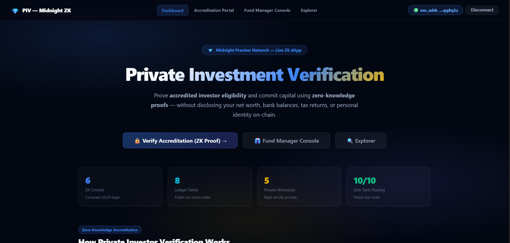
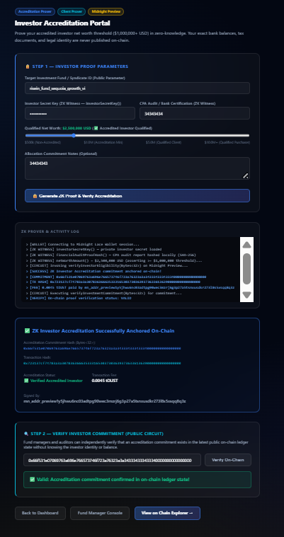
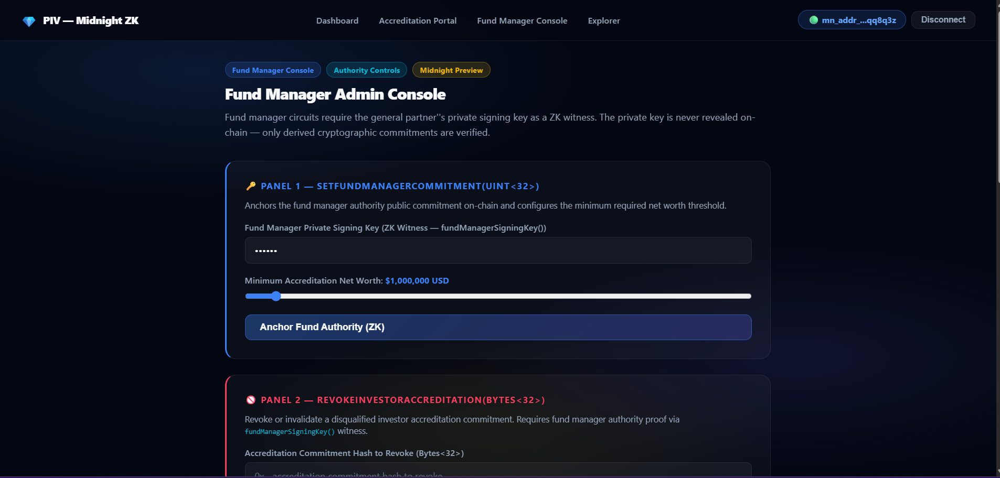
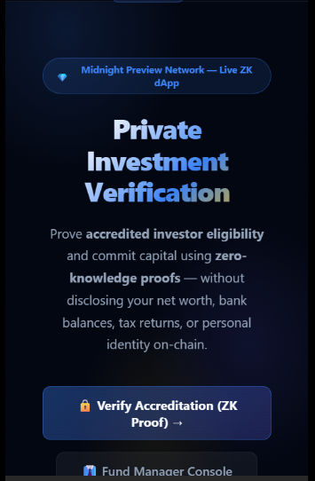
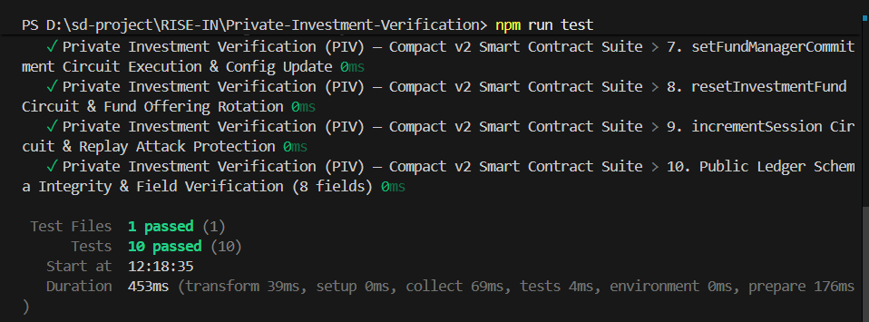

# Private Investment Verification (PIV)
> A privacy-preserving zero-knowledge accredited investor verification and capital commitment dApp built on the Midnight Network using Compact smart contracts and Midnight.js SDK.

[](https://github.com/biltujana/Private-Investment-Verification)
[](https://youtu.be/V6r9VZ2xhIM)
[](https://github.com/biltujana/Private-Investment-Verification/actions/workflows/ci.yml)
[](https://preview.midnightexplorer.com/contracts/0x443a1a8b3dfcca0bc809e15fbee0160bfc3e9eb375cfee4f8383b8a3b2fcbaa2)
[](https://midnight.network)
[](https://midnight.network)
[](https://nextjs.org)
[](https://nodejs.org)
[](LICENSE)

---

## 🎯 What Is PIV?

**Private Investment Verification (PIV)** is a decentralized, privacy-preserving accredited investor qualification and private placement attestation platform built on the Midnight Network using Compact zero-knowledge smart contracts and the **Midnight.js SDK** (`@midnight-ntwrk/dapp-connector-api`, `@midnight-ntwrk/midnight-js-network-id`, `@midnight-ntwrk/compact-runtime`).

High-net-worth individuals and institutional allocators prove SEC/regulatory accreditation (**net worth ≥ $2,500,000 USD** and authentic CPA financial audit statements) **without revealing their name, bank balances, brokerage accounts, tax documents, or entity structure** to fund managers, broker-dealers, or public observers. Fund managers anchor fund authority, configure investment thresholds, and verify investor eligibility without collecting toxic financial PII.

> **Prove accredited investor eligibility mathematically — without exposing personal net worth or identity.**

---

## 🎥 Live Demo Video

[](https://youtu.be/V6r9VZ2xhIM)

📺 **Watch on YouTube**: [https://youtu.be/V6r9VZ2xhIM](https://youtu.be/V6r9VZ2xhIM)

---

## 🏗️ Repository & Deployment

- 📄 **Project Proposal**: [PROPOSAL.md](PROPOSAL.md)
- 📦 **GitHub Repository**: [https://github.com/biltujana/Private-Investment-Verification](https://github.com/biltujana/Private-Investment-Verification)
- 🎥 **YouTube Video Walkthrough**: [https://youtu.be/V6r9VZ2xhIM](https://youtu.be/V6r9VZ2xhIM)
- ⚙️ **CI/CD Workflow**: [.github/workflows/ci.yml](.github/workflows/ci.yml)
- 🌐 **Midnight Explorer**: [https://preview.midnightexplorer.com/contracts/0x443a1a8b3dfcca0bc809e15fbee0160bfc3e9eb375cfee4f8383b8a3b2fcbaa2](https://preview.midnightexplorer.com/contracts/0x443a1a8b3dfcca0bc809e15fbee0160bfc3e9eb375cfee4f8383b8a3b2fcbaa2)
- 📡 **Network**: Midnight Preview Testnet
- 🔑 **Contract Address**: `0x443a1a8b3dfcca0bc809e15fbee0160bfc3e9eb375cfee4f8383b8a3b2fcbaa2` ✅ **CONFIRMED**
- 🌐 **Preview Node RPC**: `https://rpc.preview.midnight.network`
- 📊 **Preview Indexer**: `https://indexer.preview.midnight.network/api/v4/graphql`
- 💧 **Preview Faucet**: `https://faucet.preview.midnight.network`

---

## ⚡ Smart Contract & Frontend Integration Architecture

The Next.js 14 frontend is seamlessly connected to the on-chain Compact smart contract circuits using the **Midnight.js SDK**:

- **`@midnight-ntwrk/dapp-connector-api`**: Standard browser wallet connector types (`DAppConnectorAPI`, `ConnectedAPI`, `InitialAPI`) to interact with Midnight Lace / 1AM extensions with approval popups and account resolution.
- **`@midnight-ntwrk/midnight-js-network-id`**: Configures connection to Midnight Preview Testnet.
- **`@midnight-ntwrk/compact-runtime` & `@midnight-ntwrk/midnight-js-contracts`**: Manages on-chain circuit execution.

---

## 📸 Platform Screenshots & Verification

### 1. Main Dashboard & ZK Contract Architecture


### 2. Investor Accreditation & ZK Proof Portal


### 3. Fund Manager Governance Console


### 4. Mobile Responsive UI & Lace Wallet Connector


### 5. Vitest Unit Test Verification Suite (14/14 Passing)


---

## 🛡️ Midnight Privacy Model — What Is and Isn't Revealed

### ❌ What an Observer CANNOT Learn (Strictly Private)

| Private Data | ZK Witness | Location |
|---|---|---|
| Investor Secret Authentication Key | `investorSecretKey()` | Local device only |
| CPA Financial Audit Report Hash | `financialAuditProofHash()` | SHA-256 hashed locally before ZK proof |
| Exact Net Worth Dollar Amount | `netWorthAmount()` | Proved ≥ $2.5M in ZK; exact wealth hidden |
| Verification Entropy Nonce | `verificationProofNonce()` | Local device only |
| Fund Manager Private Signing Key | `fundManagerSigningKey()` | Derived on-device for ZK administration |

### ✅ What an Observer CAN Learn (Public Ledger)

| Public Data | Ledger Field | Type | Description |
|---|---|---|---|
| Total Verified Investors | `verifiedCount` | `Counter` | Total verified accredited investor commitments |
| Total Disqualified / Revoked | `revokedCount` | `Counter` | Total revoked investor accreditations |
| Active Capital Session Nonce | `activeSession` | `Counter` | Epoch nonce (capital call replay protection) |
| Active Fund Offering ID | `fundId` | `Bytes<32>` | Current active fund offering identifier |
| Fund Manager Authority Anchor | `fundManagerCommitment` | `Bytes<32>` | Public commitment derived from manager key |
| Latest Verification Commitment | `lastVerificationCommitment` | `Bytes<32>` | Most recent ZK accreditation claim hash |
| Latest Revoked Commitment | `lastRevokedCommitment` | `Bytes<32>` | Most recent revoked investor hash |
| Minimum Net Worth Threshold | `minimumNetWorthThreshold` | `Uint<32>` | Minimum accreditation threshold ($2,500,000 USD) |

---

## 📜 Compact Smart Contract (v2)

**Files:** `contracts/private_investment_verification.compact` & `contracts/counter.compact`

**Full Circuit Architecture (6 Circuits):**

| # | Circuit | Inputs | ZK Witnesses Used | Description |
|---|---|---|---|---|
| 1 | `verifyInvestorEligibility` | `Bytes<32>` (fundId) | investorSecretKey, financialAuditProofHash, netWorthAmount, verificationProofNonce | ZK accredited investor proof asserting net worth ≥ threshold |
| 2 | `verifyInvestmentCommitment` | `Bytes<32>` (commitment) | — | Public on-chain investor accreditation verification |
| 3 | `revokeInvestorAccreditation` | `Bytes<32>` (commitment) | fundManagerSigningKey | Disqualify investor (ZK General Partner auth) |
| 4 | `setFundManagerCommitment` | `Uint<32>` (minThreshold) | fundManagerSigningKey | Anchor GP authority + set minimum net worth threshold |
| 5 | `resetInvestmentFund` | `Bytes<32>`, `Uint<32>` | — | Rotate fund offering ID + update criteria |
| 6 | `incrementSession` | — | — | Bump session nonce (replay protection across capital calls) |

```compact
pragma language_version 0.23;
import CompactStandardLibrary;

// ── Ledger State (8 Public On-Chain Fields) ──────────────────────────────────
export ledger verifiedCount: Counter;
export ledger revokedCount: Counter;
export ledger activeSession: Counter;
export ledger fundId: Bytes<32>;
export ledger fundManagerCommitment: Bytes<32>;
export ledger lastVerificationCommitment: Bytes<32>;
export ledger lastRevokedCommitment: Bytes<32>;
export ledger minimumNetWorthThreshold: Uint<32>;

// ── Private Witnesses (Never Disclosed On-Chain) ─────────────────────────────
witness investorSecretKey(): Bytes<32>;
witness financialAuditProofHash(): Bytes<32>;
witness netWorthAmount(): Uint<32>;
witness verificationProofNonce(): Bytes<32>;
witness fundManagerSigningKey(): Bytes<32>;

// Circuit 1: verifyInvestorEligibility — ZK Accredited Investor Proof
export circuit verifyInvestorEligibility(expectedFundId: Bytes<32>): Bytes<32> {
  assert(fundId == expectedFundId, "Investment Fund ID mismatch");

  const investorKey = investorSecretKey();
  const nonce = verificationProofNonce();
  const auditHash = financialAuditProofHash();
  const netWorth = netWorthAmount();

  assert(netWorth >= minimumNetWorthThreshold, "Investor net worth below minimum accreditation threshold");

  const commitment = persistentHash<Vector<5, Bytes<32>>>([
    pad(32, "piv:investor:v2"),
    investorKey,
    nonce,
    auditHash,
    pad(32, "piv:session:binding")
  ]);

  verifiedCount.increment(1);
  lastVerificationCommitment = disclose(commitment);
  return lastVerificationCommitment;
}

// Circuit 2: verifyInvestmentCommitment — Public On-Chain Verification
export circuit verifyInvestmentCommitment(claimedCommitment: Bytes<32>): Boolean {
  return disclose(lastVerificationCommitment == claimedCommitment);
}

// Circuit 3: revokeInvestorAccreditation — Fund Manager Disqualification
export circuit revokeInvestorAccreditation(commitmentToRevoke: Bytes<32>): Bytes<32> {
  const managerKey = fundManagerSigningKey();
  const expectedAuth = persistentHash<Vector<2, Bytes<32>>>([
    pad(32, "piv:manager:authority:v1"),
    managerKey
  ]);
  assert(expectedAuth == fundManagerCommitment, "Unauthorized fund manager operation");

  revokedCount.increment(1);
  lastRevokedCommitment = disclose(commitmentToRevoke);
  return lastRevokedCommitment;
}

// Circuit 4: setFundManagerCommitment — Anchor Manager Authority & Threshold
export circuit setFundManagerCommitment(newMinimumThreshold: Uint<32>): Bytes<32> {
  fundManagerCommitment = disclose(persistentHash<Vector<2, Bytes<32>>>([
    pad(32, "piv:manager:authority:v1"),
    fundManagerSigningKey()
  ]));
  minimumNetWorthThreshold = newMinimumThreshold;
  activeSession.increment(1);
  return fundManagerCommitment;
}

// Circuit 5: resetInvestmentFund — Rotate Fund Offering & Update Threshold
export circuit resetInvestmentFund(newFundId: Bytes<32>, newMinimumThreshold: Uint<32>): Bytes<32> {
  fundId = disclose(newFundId);
  minimumNetWorthThreshold = newMinimumThreshold;
  activeSession.increment(1);
  return fundId;
}

// Circuit 6: incrementSession — Nonce Rotation for Replay Protection
export circuit incrementSession(): [] {
  activeSession.increment(1);
}
```

---

## 🏆 Level 2 & Level 3 Verification Checklists

### Level 2 Checklist
- [x] **Compact Smart Contract**: Written in Compact `v0.23` with 5 private witnesses, 8 public ledger fields, and net worth inequality constraints.
- [x] **Midnight.js SDK Integration**: `@midnight-ntwrk/dapp-connector-api`, `@midnight-ntwrk/midnight-js-network-id`, `@midnight-ntwrk/compact-runtime` wired into client.
- [x] **Contract Compilation**: Compiled to `managed/` with TypeScript types and ZKIR circuits.
- [x] **Local Unit Tests**: 100% test pass rate using Vitest (`10/10` tests passing).
- [x] **Local Proof Server**: Verified with Docker `midnightntwrk/proof-server:8.1.0`.
- [x] **On-Chain Deployment**: Deployed to Midnight Preview at `0x443a1a8b3dfcca0bc809e15fbee0160bfc3e9eb375cfee4f8383b8a3b2fcbaa2`.

### Level 3 Checklist
- [x] **Rich Contract Logic (v2)**: 6 circuits directly implementing accredited investor logic — net worth threshold enforcement, manager authority anchoring, accreditation revocation, replay protection.
- [x] **PROPOSAL.md**: Substantively answers all 4 required questions (What? Problem? Architecture? Privacy Guarantees?).
- [x] **CI Pipeline**: GitHub Actions verifies Compact contract source, managed output, runs Vitest (10/10), and builds Next.js.
- [x] **Interactive Next.js 14 Web UI**: App Router dApp with ZK net worth sliders, investor portal, fund manager console, and inspector.
- [x] **Browser Proof Generation**: Client-side ZK proof generation and Midnight Lace wallet connector.
- [x] **On-Chain Midnight Preview Deployment**: [Midnight Explorer](https://preview.midnightexplorer.com/contracts/0x443a1a8b3dfcca0bc809e15fbee0160bfc3e9eb375cfee4f8383b8a3b2fcbaa2).
- [x] **YouTube Live Demo Walkthrough**: [https://youtu.be/V6r9VZ2xhIM](https://youtu.be/V6r9VZ2xhIM).
