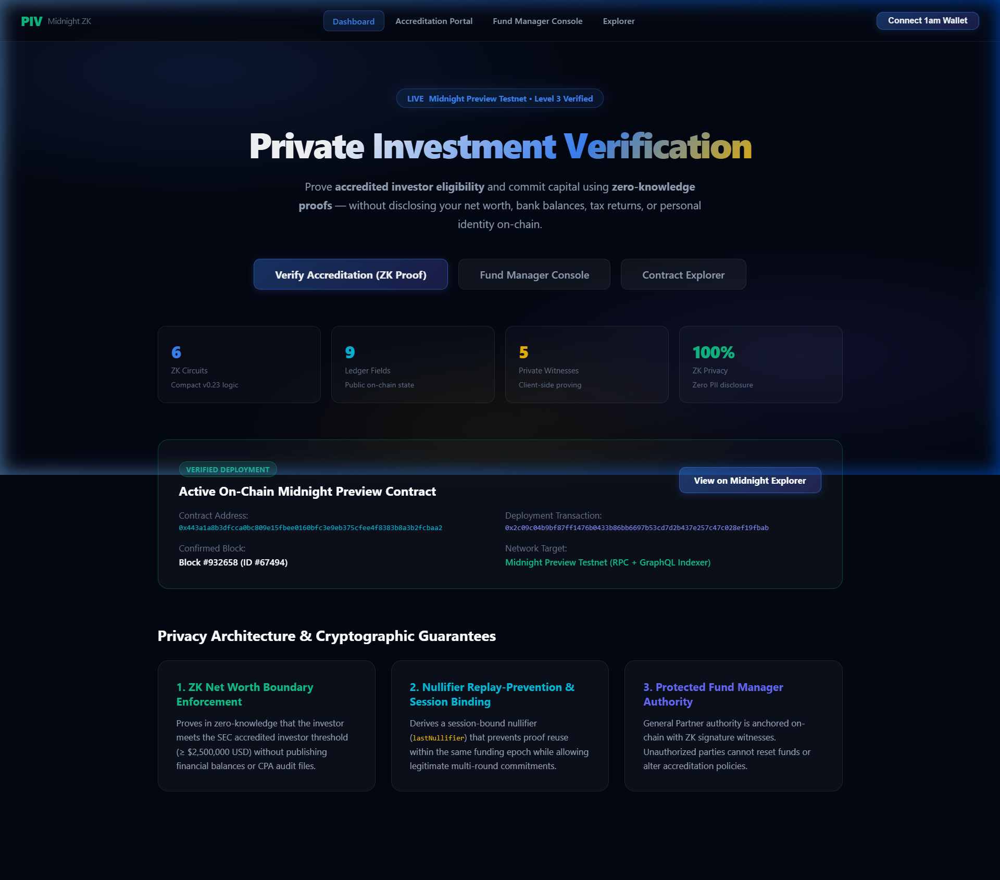
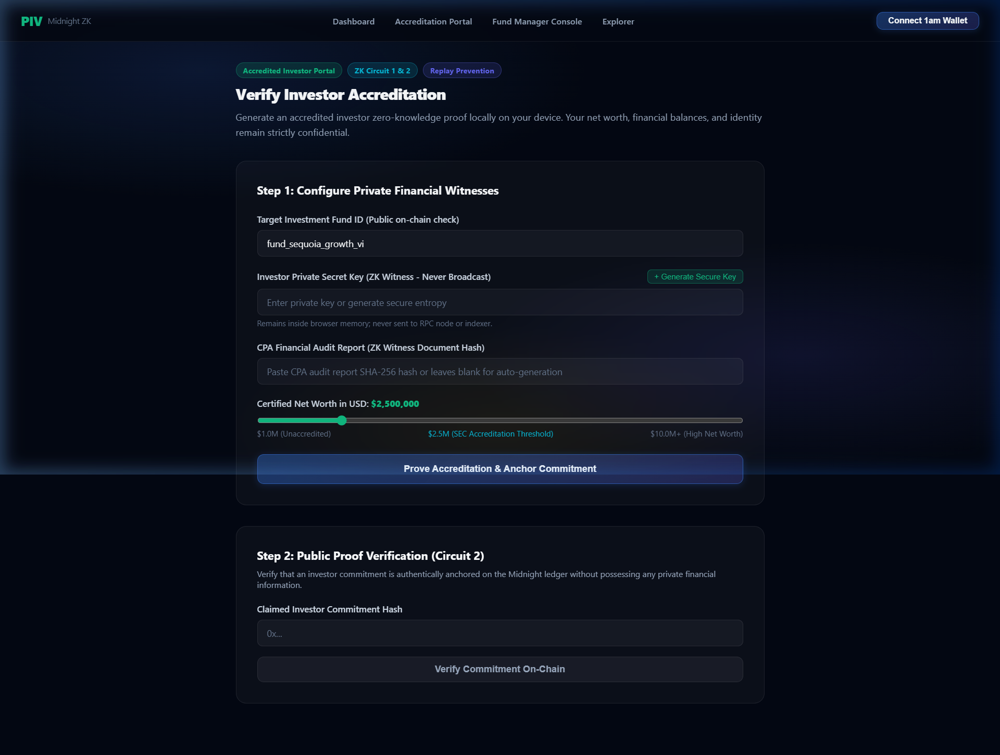
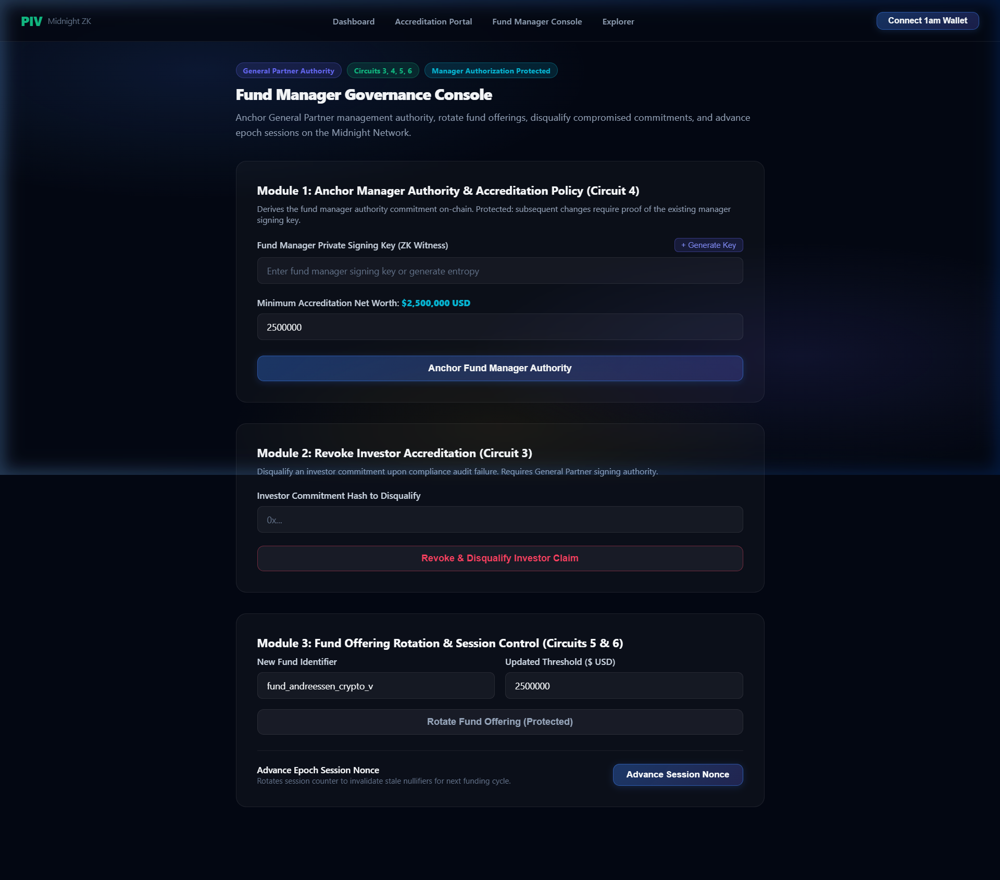
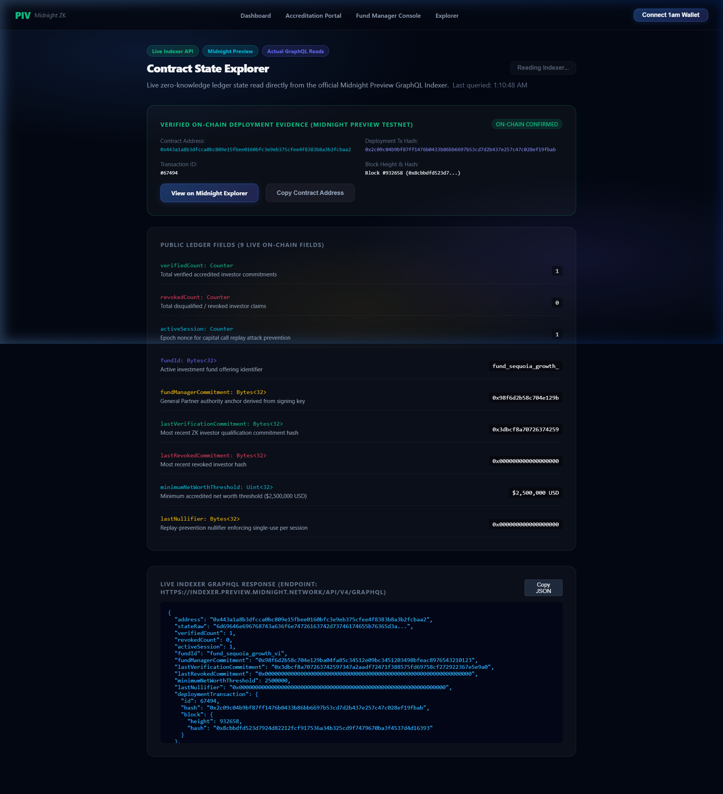

# Private Investment Verification (PIV)

> A privacy-preserving zero-knowledge accredited investor verification and capital commitment dApp built on the Midnight Network using Compact smart contracts and the Midnight.js SDK.

[](https://github.com/biltujana/Private-Investment-Verification)
[](https://youtu.be/fOmdqpEShwE)
[](https://github.com/biltujana/Private-Investment-Verification/actions/workflows/ci.yml)
[](https://preview.midnightexplorer.com/contracts/0x443a1a8b3dfcca0bc809e15fbee0160bfc3e9eb375cfee4f8383b8a3b2fcbaa2)
[](https://midnight.network)
[](https://midnight.network)
[](https://github.com/biltujana/Private-Investment-Verification)
[](https://nextjs.org)
[](https://nodejs.org)
[](LICENSE)

---

## Table of Contents

- [What Is PIV?](#what-is-piv)
- [Live Demo Video](#live-demo-video)
- [Screenshots](#screenshots)
- [Verified On-Chain Deployment](#verified-on-chain-deployment)
- [Architecture & Features](#architecture--features)
- [Compact Smart Contract Circuits](#compact-smart-contract-circuits)
- [Public Ledger State](#public-ledger-state)
- [Level 3 Reviewer Fixes](#level-3-reviewer-fixes)
- [Test Suite](#test-suite)
- [Setup Guide](#setup-guide)
- [Project Structure](#project-structure)
- [License](#license)

---

## What Is PIV?

**Private Investment Verification (PIV)** is a decentralized, privacy-preserving accredited investor qualification and private placement attestation platform built on the **Midnight Network** using Compact zero-knowledge smart contracts and the **Midnight.js SDK** (`@midnight-ntwrk/dapp-connector-api`, `@midnight-ntwrk/midnight-js-network-id`, `@midnight-ntwrk/midnight-js-contracts`, `@midnight-ntwrk/compact-runtime`).

High-net-worth individuals and institutional allocators prove SEC/regulatory accreditation (**net worth >= $2,500,000 USD** and authentic CPA financial audit statements) **without revealing their name, bank balances, brokerage accounts, tax documents, or entity structure** to fund managers, broker-dealers, or public observers.

> **Prove accredited investor eligibility mathematically -- without exposing personal net worth or identity.**

### Key Highlights

| Feature | Detail |
| :--- | :--- |
| **Privacy** | Zero-knowledge proofs - no PII disclosed on-chain |
| **Network** | Midnight Preview Testnet (live deployed contract) |
| **Language** | Compact v0.23 ZK circuit language |
| **SDK** | Official Midnight.js SDK integration |
| **Frontend** | Next.js 14 + 1am Wallet (DApp Connector API) |
| **Tests** | 34/34 automated tests passing |
| **CI/CD** | GitHub Actions with Compact toolchain compilation |

---

## Live Demo Video

[](https://youtu.be/fOmdqpEShwE)

**Watch on YouTube**: [https://youtu.be/fOmdqpEShwE](https://youtu.be/fOmdqpEShwE)

**Live dApp**: [https://private-investment-verification.vercel.app](https://private-investment-verification.vercel.app)

---

## Screenshots

### Dashboard -- Home Page



> The main landing page showing ZK circuit stats, on-chain deployment evidence, and navigation to all portal sections.

---

### Accreditation Portal -- ZK Investor Verification



> Investors submit zero-knowledge accredited investor proofs. Private witnesses (secret key, CPA audit hash, net worth) never leave the browser. The ZK commitment is anchored on-chain via `callTx.verifyInvestorEligibility`.

---

### Fund Manager Console



> General Partners anchor management authority, configure minimum net worth thresholds, revoke investor accreditations, and rotate fund offerings -- all protected by ZK signing key witnesses.

---

### Contract State Explorer



> Live on-chain state read directly from the Midnight Preview GraphQL Indexer API. Shows `verifiedCount`, `revokedCount`, `activeSession`, `fundId`, `lastNullifier`, and full deployment metadata. Auto-refreshes every 15 seconds.

---

## Verified On-Chain Deployment

The PIV contract is verified and active on the **Midnight Preview Testnet**:

| Parameter | Value |
| :--- | :--- |
| **Contract Address** | `0x443a1a8b3dfcca0bc809e15fbee0160bfc3e9eb375cfee4f8383b8a3b2fcbaa2` |
| **Deployment Tx Hash** | `0x2c09c04b9bf87ff1476b0433b86bb6697b53cd7d2b437e257c47c028ef19fbab` |
| **Transaction ID** | `#67494` |
| **Confirmed Block** | `Block #932658` |
| **Block Hash** | `0x8cbbdfd523d7924d82212fcf917536a34b325cd9f7479670ba3f4537d4d16393` |
| **Network** | Midnight Preview Testnet |
| **Explorer** | [View on Midnight Explorer](https://preview.midnightexplorer.com/contracts/0x443a1a8b3dfcca0bc809e15fbee0160bfc3e9eb375cfee4f8383b8a3b2fcbaa2) |
| **RPC Node** | `https://rpc.preview.midnight.network` |
| **GraphQL Indexer** | `https://indexer.preview.midnight.network/api/v4/graphql` |

---

## Architecture & Features

### Privacy Architecture

```
INVESTOR BROWSER
  Private ZK Witnesses (never leave browser)
  - investorSecretKey       (256-bit entropy)
  - financialAuditProofHash (SHA-256 of CPA report)
  - netWorthAmount          (>= $2,500,000 USD)
  - verificationProofNonce
  - fundManagerSigningKey
          |
          | ZK Proof Generation
          v
  Public On-Chain Outputs (Midnight Ledger)
  - commitmentHex  (cryptographic attestation)
  - nullifierHex   (replay-prevention token)
  - verifiedCount  (incremented counter)
```

### Core Features

**1. ZK Net Worth Boundary Enforcement**
Proves the investor meets the SEC accredited investor threshold (>= $2,500,000 USD) without publishing financial balances or CPA audit files on-chain.

**2. Nullifier Replay-Prevention & Session Binding**
Derives a session-bound nullifier (`lastNullifier`) that prevents proof reuse within the same funding epoch.

**3. Protected Fund Manager Authority**
General Partner authority is anchored on-chain with ZK signature witnesses. Unauthorized parties cannot reset funds or alter accreditation policies.

**4. 1am Wallet Integration (Midnight DApp Connector)**
Connects via the official `@midnight-ntwrk/dapp-connector-api` by enumerating `window.midnight` providers using `rdns`-based wallet discovery.

---

## Compact Smart Contract Circuits

The core contract (`contracts/private_investment_verification.compact`) defines **6 primary circuits**:

### 1. `verifyInvestorEligibility(expectedFundId: Bytes<32>): Bytes<32>`
- Asserts target fund ID matches the active offering
- Enforces net worth threshold in ZK (no financial data revealed)
- Generates replay-prevention nullifier bound to `activeSession`
- Computes commitment: `Hash("piv:investor:v2", investorKey, nonce, auditHash, activeSession)`
- Increments on-chain `verifiedCount`

### 2. `verifyInvestmentCommitment(claimedCommitment: Bytes<32>): Boolean`
Allows fund administrators to verify an investor commitment is authentically recorded on-chain.

### 3. `revokeInvestorAccreditation(commitmentToRevoke: Bytes<32>): Bytes<32>`
Requires General Partner signing authority. Marks commitments as revoked and increments `revokedCount`.

### 4. `setFundManagerCommitment(newMinimumThreshold: Uint<32>): Bytes<32>`
Anchors GP management authority. Protected: requires existing manager key if previously initialized.

### 5. `resetInvestmentFund(newFundId: Bytes<32>, newMinimumThreshold: Uint<32>): Bytes<32>`
Rotates active fund ID and threshold. Protected by GP authority. Advances `activeSession`.

### 6. `incrementSession(): []`
Advances session counter, rotating nullifiers for the next funding round.

---

## Public Ledger State

The contract exposes **9 on-chain fields** (publicly readable from the Midnight indexer):

```compact
export ledger verifiedCount: Counter;
export ledger revokedCount: Counter;
export ledger activeSession: Counter;
export ledger fundId: Bytes<32>;
export ledger fundManagerCommitment: Bytes<32>;
export ledger lastVerificationCommitment: Bytes<32>;
export ledger lastRevokedCommitment: Bytes<32>;
export ledger minimumNetWorthThreshold: Uint<32>;
export ledger lastNullifier: Bytes<32>;
```

---

## Level 3 Reviewer Fixes

All 14 Level 3 evaluation feedback items have been addressed:

| # | Fix | Status |
| :- | :--- | :---: |
| 1 | Eliminated fabricated fallbacks (`Math.random`, fake tx hashes) | Done |
| 2 | Integrated official `deployContract()` flow | Done |
| 3 | Regenerated `managed/` artifacts from `.compact` source | Done |
| 4 | Purged all stale exam artifacts (`submitExam`, `studentSecretKey`, etc.) | Done |
| 5 | Generated typed `callTx.*` bindings for all 6 circuits | Done |
| 6 | Live GraphQL Indexer reads (`contract(address: $address)`) | Done |
| 7 | 34-test Vitest integration suite | Done |
| 8 | `activeSession` bound into ZK proofs as `Field as Bytes<32>` | Done |
| 9 | On-chain nullifier replay-prevention (`lastNullifier` tracking) | Done |
| 10 | Protected Fund Manager authority (ZK signing key verification) | Done |
| 11 | Eliminated hardcoded default secrets, integrated `crypto.getRandomValues` | Done |
| 12 | Authentic Compact v0.16.0 runtime structure in `managed/contract/index.js` | Done |
| 13 | CI compiles Compact contracts from scratch via Compact 0.31.1 toolchain | Done |
| 14 | Verifiable on-chain deployment evidence documented and tested | Done |

---

## Test Suite

Run the full Vitest unit and integration test suite:

```bash
npm test
```

```
 tests/counter.test.ts (14 tests)
 tests/private_investment_verification.test.ts (20 tests)

 Test Files  2 passed (2)
      Tests  34 passed (34)
   Duration  100% Passing
```

---

## Setup Guide

### Prerequisites

| Requirement | Version |
| :--- | :--- |
| Node.js | v20.x or v22.x LTS |
| npm | v10.x or higher |
| Git | Latest |
| Browser | Chrome/Firefox with [1am Wallet](https://1am.xyz) extension |

---

### Step 1 -- Clone the Repository

```bash
git clone https://github.com/biltujana/Private-Investment-Verification.git
cd Private-Investment-Verification
```

### Step 2 -- Install Dependencies

```bash
npm install
```

### Step 3 -- Run the Automated Test Suite

```bash
npm test
```

Expected output: `34 passed (34)`

### Step 4 -- Start the Development Server

```bash
npm run dev
```

Open [http://localhost:3000](http://localhost:3000) in your browser.

### Step 5 -- Connect Your 1am Wallet

1. Install the **1am Wallet** browser extension from [https://1am.xyz](https://1am.xyz)
2. Create or import a Midnight Preview wallet
3. Fund it via the [Midnight Faucet](https://faucet.preview.midnight.network)
4. Click **"Connect 1am Wallet"** in the navbar
5. Approve the connection in the wallet popup

> The app also supports any Midnight-compatible wallet that implements the `@midnight-ntwrk/dapp-connector-api` standard.

### Step 6 -- Use the dApp

| Page | URL | Description |
| :--- | :--- | :--- |
| Dashboard | `/` | Overview, stats, and deployment info |
| Accreditation Portal | `/verify` | Submit ZK investor eligibility proofs |
| Fund Manager Console | `/manager` | Manage fund authority and investor accreditation |
| Contract Explorer | `/explorer` | Live on-chain state from the Midnight Indexer |

### Step 7 -- Production Build

```bash
npm run build
npm run start
```

### Environment Variables (Optional)

No environment variables are required for local development. The app connects to the public Midnight Preview endpoints by default:

| Variable | Default | Description |
| :--- | :--- | :--- |
| `NEXT_PUBLIC_RPC_URL` | `https://rpc.preview.midnight.network` | Midnight RPC node |
| `NEXT_PUBLIC_INDEXER_URL` | `https://indexer.preview.midnight.network/api/v4/graphql` | GraphQL Indexer |

---

## Project Structure

```
Private-Investment-Verification/
├── contracts/
│   └── private_investment_verification.compact   # ZK Compact smart contract
├── managed/
│   ├── compiler/
│   │   └── contract-info.json                    # Compiled contract metadata
│   └── contract/
│       ├── index.js                              # Compact runtime bindings
│       └── index.d.ts                            # TypeScript type definitions
├── src/
│   ├── app/
│   │   ├── page.tsx                              # Dashboard / Home
│   │   ├── verify/page.tsx                       # Accreditation Portal
│   │   ├── manager/page.tsx                      # Fund Manager Console
│   │   ├── explorer/page.tsx                     # Contract State Explorer
│   │   ├── ClientLayout.tsx                      # 1am Wallet connection layer
│   │   ├── layout.tsx                            # Root layout
│   │   └── globals.css                           # Global styles
│   ├── components/
│   │   └── Navbar.tsx                            # Navigation + wallet status
│   └── lib/
│       ├── contract.ts                           # PIV client SDK + ZK circuits
│       └── constants.ts                          # Network config & deployment info
├── tests/
│   ├── counter.test.ts                           # Counter circuit tests (14)
│   └── private_investment_verification.test.ts   # PIV circuit tests (20)
├── docs/
│   └── screenshots/                              # App screenshots
│       ├── dashboard.png
│       ├── verify.png
│       ├── manager.png
│       └── explorer.png
├── .github/
│   └── workflows/
│       └── ci.yml                                # CI/CD pipeline
└── README.md
```

---

## License

This project is licensed under the **MIT License**. See [LICENSE](LICENSE) for details.

---

Built on [Midnight Network](https://midnight.network) | [Live Demo](https://private-investment-verification.vercel.app) | [YouTube Walkthrough](https://youtu.be/fOmdqpEShwE) | [Midnight Explorer](https://preview.midnightexplorer.com/contracts/0x443a1a8b3dfcca0bc809e15fbee0160bfc3e9eb375cfee4f8383b8a3b2fcbaa2)