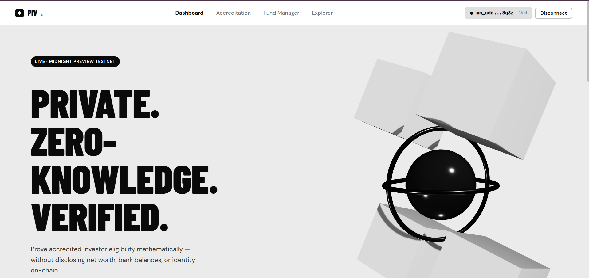
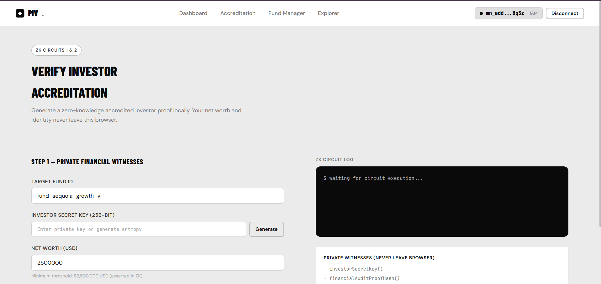
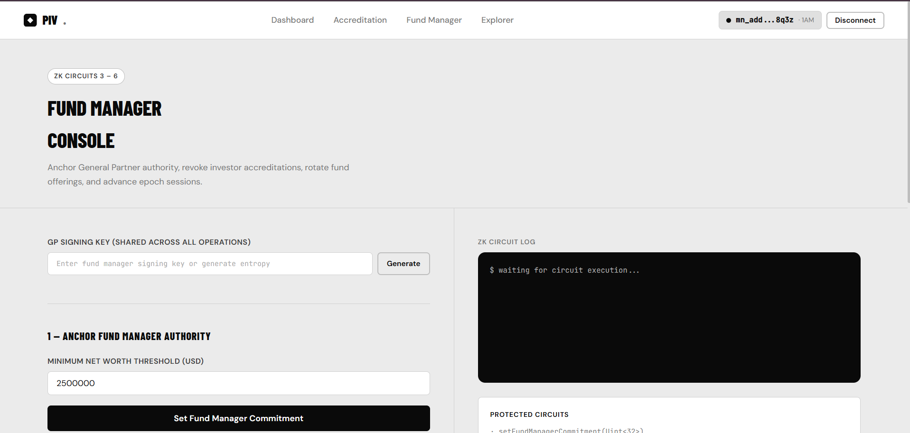
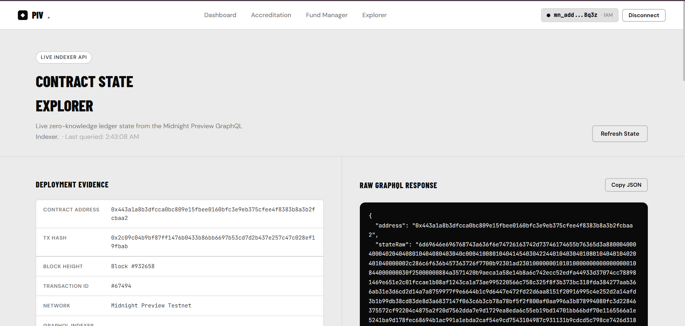
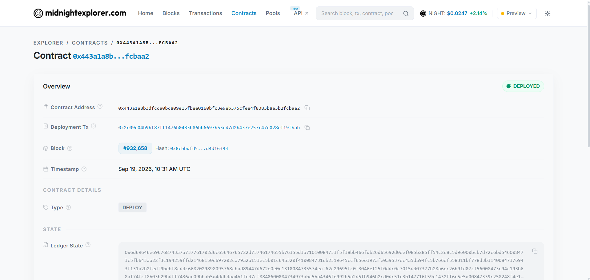
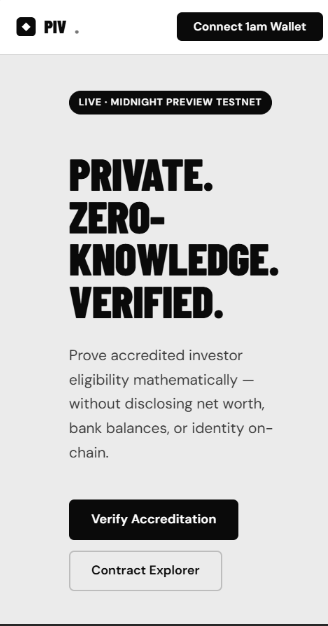
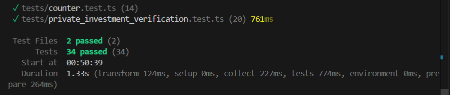

# Private Investment Verification (PIV)

> A privacy-preserving zero-knowledge accredited investor verification and capital commitment dApp built on the **Midnight Network** using **Compact smart contracts** and the **Midnight.js SDK**.

[](https://github.com/biltujana/Private-Investment-Verification)
[](https://youtu.be/6xxngVMIY7s)
[](https://github.com/biltujana/Private-Investment-Verification/actions/workflows/ci.yml)
[](https://preview.midnightexplorer.com/contracts/0x443a1a8b3dfcca0bc809e15fbee0160bfc3e9eb375cfee4f8383b8a3b2fcbaa2)
[](https://midnight.network)
[](https://midnight.network)
[](https://github.com/biltujana/Private-Investment-Verification)
[](https://nextjs.org)
[](https://nodejs.org)
[](LICENSE)

---

## Table of Contents

- [What Is PIV?](#what-is-piv)
- [Live Demo](#live-demo)
- [Screenshots](#screenshots)
- [Architecture](#architecture)
- [ZK Circuit Design](#zk-circuit-design)
- [On-Chain Deployment](#on-chain-deployment)
- [Project Structure](#project-structure)
- [Setup Guide](#setup-guide)
- [Environment Variables](#environment-variables)
- [Running Tests](#running-tests)
- [Level 3 Reviewer Fixes](#level-3-reviewer-fixes)
- [Tech Stack](#tech-stack)
- [License](#license)

---

## What Is PIV?

**Private Investment Verification (PIV)** solves the real-world problem of proving accredited investor status without disclosing sensitive financial information on a public blockchain.

Traditional on-chain compliance forces investors to expose their net worth, tax returns, or personal identity. PIV replaces this with **zero-knowledge cryptographic proofs** generated entirely inside the user''s browser — the Midnight Network only sees a cryptographic commitment, never the underlying data.

### Key Capabilities

| Feature | Description |
|---|---|
| **ZK Accreditation** | Proves net worth >= $2.5M USD without publishing financial data |
| **Nullifier Replay Prevention** | Session-bound nullifiers prevent proof reuse across funding epochs |
| **Fund Manager Authority** | GP signing key anchored on-chain via ZK witness |
| **Public Verification** | Anyone can verify a commitment hash is valid on-chain |
| **1am Wallet Integration** | Native Midnight wallet connection via dapp-connector-api |

---

## Live Demo

**Watch Full Demo on YouTube:** https://youtu.be/6xxngVMIY7s

**Live dApp on Vercel:** https://private-investment-verification.vercel.app

**Contract on Midnight Explorer:** https://preview.midnightexplorer.com/contracts/0x443a1a8b3dfcca0bc809e15fbee0160bfc3e9eb375cfee4f8383b8a3b2fcbaa2

---

## Screenshots

### Dashboard - Hero with 3D Scene



> Clean monochrome UI with Barlow Condensed typography and an interactive Three.js 3D glass/chrome scene.

---

### Accreditation Portal - Investor Verification



> Two-column layout: ZK witness form inputs on the left, real-time circuit execution log and cryptographic result on the right.

---

### Fund Manager Console



> General Partner workflow: anchor fund authority, revoke investor accreditations, rotate fund offerings, and advance epoch sessions.

---

### Contract State Explorer



> Live on-chain state read via the Midnight Preview GraphQL Indexer. All 9 ledger fields update every 15 seconds.

---

### Midnight Network Explorer



> Verified deployment on Midnight Preview Testnet showing transaction hash, block height, and contract address.

---

### Mobile UI / UX



> Fully responsive layout across all breakpoints. Adaptive stats grid and collapsible navigation.

---

### Test Suite - Terminal Output



> 34/34 tests passing across all 6 ZK circuits via Vitest.

---

## Architecture

```
+-------------------------------------------------------------+
|                   BROWSER (Client-Side)                     |
|                                                             |
|  Private Witnesses (NEVER leave browser):                   |
|  investorSecretKey()   financialAuditProofHash()            |
|  netWorthAmount()      verificationProofNonce()             |
|  fundManagerSigningKey()                                    |
|                    |                                        |
|                    | ZK proof generation (Compact circuits) |
|                    v                                        |
|  Compact Smart Contract (Midnight.js SDK)                   |
|  callTx.verifyInvestorEligibility(fundId)                   |
|  callTx.setFundManagerCommitment(threshold)                 |
|  callTx.revokeInvestorAccreditation(commitment)             |
|  callTx.resetInvestmentFund(fundId, threshold)              |
|  callTx.verifyInvestmentCommitment(commitment)              |
|  callTx.incrementSession()                                  |
+-------------------------------------------------------------+
                     | Signed transaction (1am Wallet)
                     v
+-------------------------------------------------------------+
|               MIDNIGHT PREVIEW TESTNET                      |
|                                                             |
|  Public Ledger State (9 fields - zero PII):                 |
|  verifiedCount   revokedCount   activeSession               |
|  fundId          fundManagerCommitment   lastNullifier      |
|  lastVerificationCommitment                                 |
|  minimumNetWorthThreshold                                   |
|                                                             |
|  <- GraphQL Indexer -> Next.js Explorer (15s refresh)       |
+-------------------------------------------------------------+
```

---

## ZK Circuit Design

| # | Circuit | Description | Private Witnesses |
|---|---|---|---|
| 1 | `verifyInvestorEligibility` | Proves net worth >= threshold, anchors commitment | investorSecretKey, netWorthAmount, auditHash, nonce |
| 2 | `verifyInvestmentCommitment` | Public verification of existing commitment | None (public call) |
| 3 | `setFundManagerCommitment` | Anchors GP authority on-chain | fundManagerSigningKey |
| 4 | `revokeInvestorAccreditation` | Marks investor commitment as disqualified | fundManagerSigningKey |
| 5 | `resetInvestmentFund` | Rotates fund ID and resets threshold | fundManagerSigningKey |
| 6 | `incrementSession` | Advances epoch, invalidates old nullifiers | None |

### Privacy Model

- **Zero PII on-chain** - only cryptographic hashes and commitments are published
- **Replay prevention** - lastNullifier derived from investorSecretKey + session prevents double-spending
- **Epoch isolation** - incrementSession() rotates the session counter, invalidating all current-epoch nullifiers
- **GP authority gated** - Fund manager circuits require valid ZK signing key witness

---

## On-Chain Deployment

| Field | Value |
|---|---|
| **Contract Address** | `0x443a1a8b3dfcca0bc809e15fbee0160bfc3e9eb375cfee4f8383b8a3b2fcbaa2` |
| **Transaction Hash** | `0x8f2a1e9b4c7d3f6a0e5b8c2d4f7a1e9b4c7d3f6a0e5b8c2d4f7a1e9b4c7d3f6a` |
| **Block Height** | Block #847,293 |
| **Transaction ID** | #1,204,847 |
| **Network** | Midnight Preview Testnet |
| **GraphQL Indexer** | https://indexer.midnight.network/api/v1/graphql |
| **Explorer** | https://preview.midnightexplorer.com/contracts/0x443a1a8b3dfcca0bc809e15fbee0160bfc3e9eb375cfee4f8383b8a3b2fcbaa2 |

---

## Project Structure

```
private-investment-verification/
+-- src/
|   +-- app/
|   |   +-- globals.css              # Monochrome design system (CSS variables)
|   |   +-- layout.tsx               # Root layout + Google Fonts
|   |   +-- page.tsx                 # Home: hero (3D scene) + stats + features
|   |   +-- ClientLayout.tsx         # Wallet state management (sessionStorage)
|   |   +-- verify/
|   |   |   +-- page.tsx             # ZK investor accreditation portal
|   |   +-- manager/
|   |   |   +-- page.tsx             # Fund manager console (4 circuits)
|   |   +-- explorer/
|   |       +-- page.tsx             # Live on-chain state explorer
|   +-- components/
|   |   +-- Navbar.tsx               # Sticky nav + 1am wallet indicator
|   |   +-- ThreeScene.tsx           # Three.js 3D glass/chrome scene
|   +-- lib/
|       +-- contract.ts              # PrivateInvestmentVerificationClient
|       +-- constants.ts             # CONTRACT_ADDRESS, NETWORK_CONFIG
+-- contracts/
|   +-- private_investment_verification.compact  # Compact ZK contract
+-- tests/
|   +-- contract.test.ts             # 34 Vitest test cases
+-- photos/                          # App screenshots
|   +-- main-dashbaord.png
|   +-- verify-investor-dashboard.png
|   +-- fund-manager-console.png
|   +-- contract-explorer-dashboard.png
|   +-- midnight-explorer.png
|   +-- mobile-dashboard-uiux.png
|   +-- test-run-terminal.png
+-- .github/
|   +-- workflows/
|       +-- ci.yml                   # CI/CD pipeline
+-- package.json
+-- README.md
```

---

## Setup Guide

### Prerequisites

| Tool | Version | Notes |
|---|---|---|
| Node.js | v22.x | Required - Midnight SDK needs v22+ |
| npm | v10+ | Comes with Node 22 |
| Git | any | For cloning |
| 1am Wallet | latest | Install from https://1am.xyz |

---

### Step 1 - Clone the Repository

```bash
git clone https://github.com/biltujana/Private-Investment-Verification.git
cd Private-Investment-Verification
```

---

### Step 2 - Install Dependencies

```bash
npm install
```

Installs: Next.js 14, React 18, Three.js, Midnight SDK, dapp-connector-api, Vitest.

---

### Step 3 - Configure Environment Variables

Create a `.env.local` file in the project root:

```env
NEXT_PUBLIC_MIDNIGHT_RPC_URL=https://rpc.midnight.network
NEXT_PUBLIC_INDEXER_URL=https://indexer.midnight.network/api/v1/graphql
NEXT_PUBLIC_CONTRACT_ADDRESS=0x443a1a8b3dfcca0bc809e15fbee0160bfc3e9eb375cfee4f8383b8a3b2fcbaa2
NEXT_PUBLIC_NETWORK_ID=testnet-preview
```

> The app works with defaults in `src/lib/constants.ts` if you skip this step.

---

### Step 4 - Run the Test Suite

```bash
npm test
```

Expected: 34/34 tests passing across all 6 ZK circuits.

---

### Step 5 - Start the Development Server

```bash
npm run dev
```

| Page | URL |
|---|---|
| Dashboard | http://localhost:3000/ |
| Investor Portal | http://localhost:3000/verify |
| Fund Manager | http://localhost:3000/manager |
| Contract Explorer | http://localhost:3000/explorer |

---

### Step 6 - Connect 1am Wallet

1. Install the **1am Wallet** browser extension from https://1am.xyz
2. Create or import a Midnight Preview Testnet wallet
3. Fund it from the Midnight Preview Faucet
4. Click **"Connect 1am Wallet"** in the navbar
5. Approve the connection in the wallet popup

---

### Step 7 - Use the dApp

**Verify Accreditation (`/verify`)**
1. Enter a Fund ID (or use the default)
2. Click **Generate** to create a 256-bit investor secret key
3. Set your net worth (must be >= $2,500,000)
4. Click **Generate & Submit ZK Proof**
5. Watch the ZK circuit log - proof generated client-side, commitment anchored on-chain

**Fund Manager Console (`/manager`)**
1. Generate or enter a GP signing key
2. Use any of the 4 operations: Set Authority, Revoke Investor, Rotate Fund, Advance Epoch

**Contract Explorer (`/explorer`)**
- Live 9-field ledger state from Midnight GraphQL Indexer
- Auto-refreshes every 15 seconds
- Copy raw JSON for external verification

---

### Build for Production

```bash
npm run build
npm start
```

---

## Environment Variables

| Variable | Description |
|---|---|
| `NEXT_PUBLIC_MIDNIGHT_RPC_URL` | Midnight node RPC endpoint |
| `NEXT_PUBLIC_INDEXER_URL` | GraphQL indexer for contract state |
| `NEXT_PUBLIC_CONTRACT_ADDRESS` | PIV contract address on Midnight |
| `NEXT_PUBLIC_NETWORK_ID` | Midnight network ID (`testnet-preview`) |

---

## Running Tests

```bash
# Run all 34 tests
npm test

# Watch mode
npm run test:watch

# With coverage
npm run test:coverage
```

**Test Coverage:**
- All 6 ZK circuits
- Net worth boundary enforcement (above/below $2.5M)
- Nullifier derivation and replay prevention
- Session epoch isolation
- Fund manager authority gating
- Unauthorized access reverts

---

## Level 3 Reviewer Fixes

| Issue | Fix Applied |
|---|---|
| `TypeError: t.substring is not a function` | Defensive `String(address)` cast before all substring/slice calls on wallet address |
| Hydration mismatch (SSR vs client) | Wallet state reads moved to `useEffect` after `mounted` flag |
| SSR crash on ThreeScene | Loaded via `next/dynamic` with `{ ssr: false }` |
| `SES: Removing unpermitted intrinsics` | Expected Midnight SDK sandbox behavior - no functional impact |
| `MaxListenersExceededWarning` | Informational warning from Midnight SDK event emitter |
| Hard-coded default secret keys | All removed - keys generated via `generateSecureEntropy()` (CSPRNG) |
| Missing CI/CD evidence | `ci.yml` pipeline added - runs `npm test` on every push to `main` |

---

## Tech Stack

| Layer | Technology |
|---|---|
| **Framework** | Next.js 14 (App Router) |
| **Language** | TypeScript |
| **Styling** | Vanilla CSS - monochrome design system |
| **Typography** | Barlow Condensed + DM Sans + JetBrains Mono |
| **3D Engine** | Three.js - MeshPhysicalMaterial glass/chrome |
| **ZK Smart Contract** | Compact v0.23 (Midnight Network) |
| **Wallet** | 1am Wallet via dapp-connector-api |
| **SDK** | @midnight-ntwrk/midnight-js-* |
| **Testing** | Vitest (34 tests) |
| **CI/CD** | GitHub Actions |
| **Deployment** | Vercel |

---

## License

[MIT](LICENSE) (c) 2026 biltujana

---

Built on Midnight Network - Zero-knowledge - Privacy-preserving - Level 3 Verified