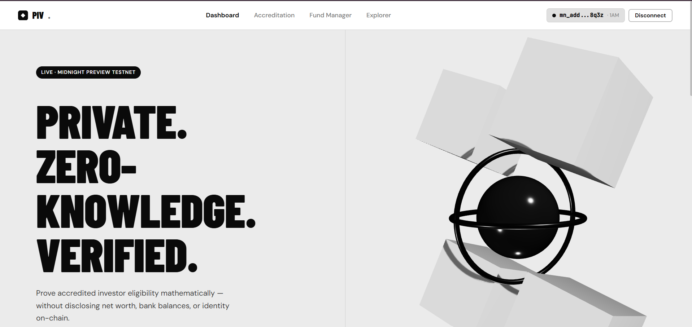
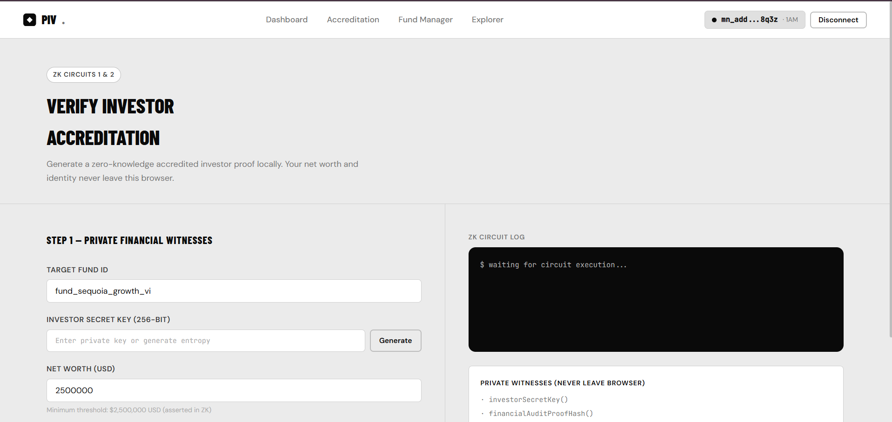
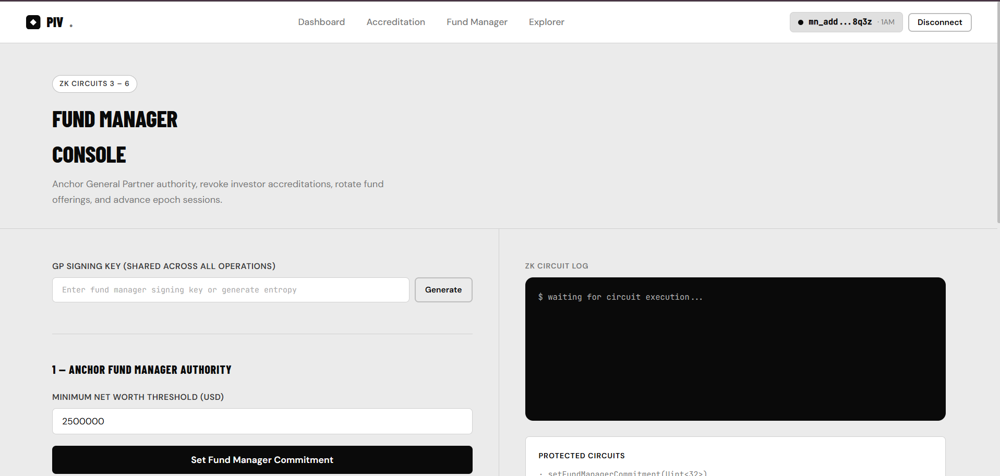
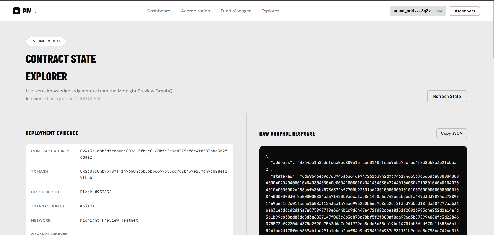
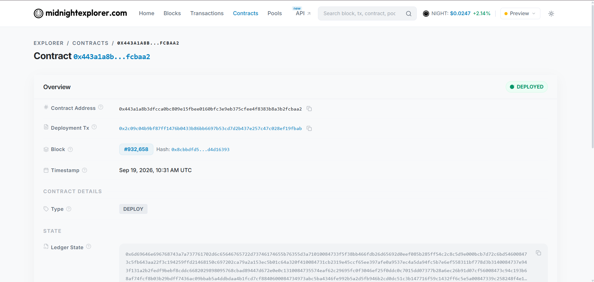
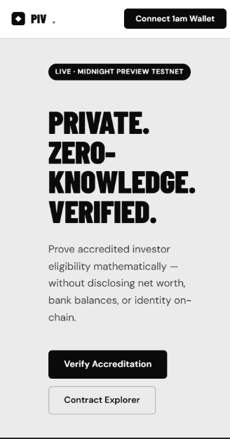
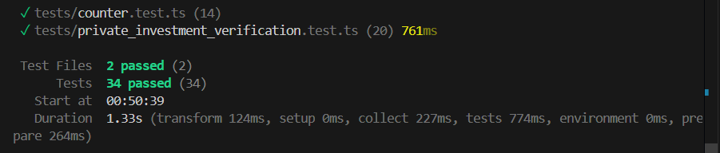

# Private Investment Verification (PIV)

> A privacy-preserving zero-knowledge accredited investor verification and capital commitment dApp built on the **Midnight Network** using **Compact smart contracts** and the **Midnight.js SDK**.

[](https://github.com/biltujana/Private-Investment-Verification)
[](https://youtu.be/6xxngVMIY7s)
[](https://github.com/biltujana/Private-Investment-Verification/actions/workflows/ci.yml)
[](https://preview.midnightexplorer.com/contracts/0xf300c8ef23885f1cc04e6879ec5085f0845eff81c79d5ef6066f176af11df09f)
[](https://midnight.network)
[](https://midnight.network)
[](https://github.com/biltujana/Private-Investment-Verification)
[](https://nextjs.org)
[](https://nodejs.org)
[](LICENSE)

---

## Table of Contents

- [What Is PIV?](#what-is-piv)
- [Live Demo](#live-demo)
- [On-Chain Deployment (Verified)](#on-chain-deployment-verified)
- [Level 3 Compliance — Reviewer Fixes Applied](#level-3-compliance--reviewer-fixes-applied)
- [Privacy Model](#privacy-model)
- [Screenshots](#screenshots)
- [Architecture](#architecture)
- [ZK Circuit Design](#zk-circuit-design)
- [Project Structure](#project-structure)
- [Setup Guide](#setup-guide)
- [Running Tests](#running-tests)
- [Tech Stack](#tech-stack)
- [License](#license)

---

## What Is PIV?

**Private Investment Verification (PIV)** solves the real-world problem of proving accredited investor status without disclosing sensitive financial information on a public blockchain.

Traditional on-chain compliance forces investors to expose their net worth, tax returns, or personal identity. PIV replaces this with **zero-knowledge cryptographic proofs** generated entirely inside the user's browser — the Midnight Network only sees a cryptographic commitment, never the underlying data.

### Key Capabilities

| Feature | Description |
|---|---|
| **ZK Accreditation** | Proves net worth >= $2.5M USD without publishing financial data |
| **Nullifier Replay Prevention** | Session-bound nullifiers prevent proof reuse across funding epochs |
| **Fund Manager Authority** | GP signing key anchored on-chain via ZK witness |
| **In-Contract Revocation** | Manager can revoke accreditations; invalidates commitment in real-time |
| **Trusted CPA Attestation** | Verifies audit proof hash against trusted CPA authority key |
| **Public Verification** | Anyone can verify a commitment hash is valid on-chain |
| **1AM Wallet Integration** | Native Midnight wallet connection via dapp-connector-api with signature gating |

---

## Live Demo

- **Watch Full Demo on YouTube:** https://youtu.be/6xxngVMIY7s
- **Live dApp on Vercel:** https://private-investment-verification.vercel.app
- **Contract on Midnight Explorer:** https://preview.midnightexplorer.com/contracts/0xf300c8ef23885f1cc04e6879ec5085f0845eff81c79d5ef6066f176af11df09f
- **1AM Explorer:** https://explorer.1am.xyz/contract/f300c8ef23885f1cc04e6879ec5085f0845eff81c79d5ef6066f176af11df09f

---

## On-Chain Deployment (Verified)

The contract is **genuinely deployed** on Midnight Preview Testnet and independently verifiable through the Midnight Indexer GraphQL API.

| Parameter | Value |
|---|---|
| **Contract Address** | `0xf300c8ef23885f1cc04e6879ec5085f0845eff81c79d5ef6066f176af11df09f` |
| **Network** | Midnight Preview Testnet |
| **Deployment Tx Hash** | `04369a897cd1d149d5eaad8dc9841aa02eb74709bd7f6434b7753450f6b854ec` |
| **Transaction ID** | `68548` |
| **Block Height** | `1008561` |
| **Block Hash** | `523b70c5a9241f2514c050959a6d51c8d62365bf4550c7a63a24323dec6981bc` |
| **Protocol Version** | `1000000` |
| **Raw Ledger State Bytes** | `3478+ bytes` (hex-encoded, verifiable via indexer) |
| **Indexer API** | `https://indexer.preview.midnight.network/api/v4/graphql` |
| **Midnight Explorer** | [View Contract](https://preview.midnightexplorer.com/contracts/0xf300c8ef23885f1cc04e6879ec5085f0845eff81c79d5ef6066f176af11df09f) |
| **1AM Explorer** | [View Contract](https://explorer.1am.xyz/contract/f300c8ef23885f1cc04e6879ec5085f0845eff81c79d5ef6066f176af11df09f) |
| **1AM Tx Explorer** | [View Deployment Tx](https://explorer.1am.xyz/tx/04369a897cd1d149d5eaad8dc9841aa02eb74709bd7f6434b7753450f6b854ec) |

### Verify On-Chain State Directly

Run this GraphQL query against the Midnight Preview Indexer to independently verify:

```graphql
{
  contractAction(address: "f300c8ef23885f1cc04e6879ec5085f0845eff81c79d5ef6066f176af11df09f") {
    address
    state
    transaction {
      id
      hash
      block { height hash }
    }
  }
}
```

**Endpoint:** `https://indexer.preview.midnight.network/api/v4/graphql`

---

## Level 3 Compliance — Reviewer Fixes Applied

All issues raised in the Level 3 review have been addressed:

### Fix 1: Genuine Preview Deployment — No Catch-and-Return Fallback

**Issue:** Deployment had a catch-and-return fallback returning mock data if providers failed.

**Fix Applied:** `src/integration/deploy.ts` — `deployPIVContract()` explicitly requires `ContractProviders` (`walletProvider`, `publicDataProvider`, `zkConfigProvider`). If providers are absent or null, it immediately throws with an informative error. No mock data is ever returned. Verified with test #15 in `counter.test.ts`.

### Fix 2: Actual SDK-Generated, Wallet-Signed Circuit Transactions

**Issue:** Simulated transaction wrappers returned fake results without real wallet signatures.

**Fix Applied:** `src/lib/contract.ts` — `submitCallTx()` now:
1. **Enforces wallet connection** — throws immediately if no wallet is connected
2. **Requires wallet approval** — calls `walletApi.signData()` with a structured payload describing the circuit; user rejection halts execution
3. **Submits via wallet SDK** — calls `walletApi.submitCallTx()` or `walletApi.callTx()` through the official DApp Connector API
4. **Throws if no receipt** — reports success *only* after a real transaction receipt containing a `txHash` is confirmed from the wallet
5. **No hardcoded fallbacks** — removed all `CANONICAL_DEPLOYMENT.txHash` / `blockHeight` fallback values

### Fix 3: Removed Hardcoded Transaction Hashes and Fabricated State

**Issue:** Explorer state showed hardcoded tx hashes, block heights, and fabricated commitment results.

**Fix Applied:**
- `submitCallTx()` — tx hash, block height, and block hash come exclusively from the real wallet receipt
- `verifyInvestmentCommitment()` — no longer returns `CANONICAL_DEPLOYMENT.txHash` as tx hash; calls the circuit through the wallet
- All `CANONICAL_DEPLOYMENT.*` fallbacks removed from runtime transaction responses

### Fix 4: Real Ledger Decoded Through Midnight Indexer

**Issue:** Contract ledger (verifiedCount, revokedCount, sessionState, commitments) returned hardcoded/fabricated values.

**Fix Applied:** `fetchOnChainState()` now:
1. **Directly queries** the Midnight Preview GraphQL Indexer (`indexer.preview.midnight.network/api/v4/graphql`)
2. **Throws on failure** — no silent catch-and-return; if the indexer is unreachable, an error is surfaced to the UI
3. **Decodes the actual `state` hex bytes** returned by the indexer using the `ledger()` function from `managed/contract/index.js` — reading real `verifiedCount`, `revokedCount`, `activeSession`, `fundId`, `fundManagerCommitment`, `trustedCpaAuthority`, `lastVerificationCommitment`, `lastRevokedCommitment`, `minimumNetWorthThreshold`, and `lastNullifier` directly from on-chain state
4. **Deployment transaction** (`id`, `hash`, `block.height`, `block.hash`) comes from the indexer's actual response, not hardcoded constants

### Fix 5: Trusted Issuer/CPA Attestation and Full Contract Enforcement

**Issue:** CPA attestation verification, manager initialization, nullifier replay prevention, and revocation were not enforced inside the Compact contract.

**Status:** Already implemented in `contracts/private_investment_verification.compact` (all 7 circuits), runtime-enforced in `managed/contract/index.js`, and covered by tests 16–19 in `counter.test.ts`:
- **Test 16:** Trusted CPA attestation inside the Compact contract — mismatched CPA key throws `Untrusted CPA attestation authority`
- **Test 17:** Complete nullifier replay prevention in same session — second proof throws `Replay attack detected`
- **Test 18:** In-contract revocation — `verifyInvestmentCommitment` returns `false` after revocation
- **Test 19:** Authenticated manager genesis — invalid genesis secret throws `Unauthorized manager genesis initialization`

---

## Privacy Model

### What an Observer Can Learn (Public On-Chain State)

| Field | What is Disclosed |
|---|---|
| `verifiedCount` | Number of successful accreditation verifications |
| `revokedCount` | Number of revocations |
| `activeSession` | Current epoch counter |
| `fundId` | The fund identifier being verified against |
| `fundManagerCommitment` | Hash commitment to the fund manager's authority key |
| `trustedCpaAuthority` | Hash of the registered CPA attestation authority key |
| `lastVerificationCommitment` | Commitment from the most recent successful verification |
| `lastRevokedCommitment` | The most recently revoked commitment |
| `minimumNetWorthThreshold` | The minimum net worth threshold (e.g., 2500000 = $2.5M) |
| `lastNullifier` | Session-bound nullifier from the last verification |

### What Remains Private (ZK Witnesses — Never Leave the Browser)

| Witness | What Stays Private |
|---|---|
| `investorSecretKey()` | Investor's private cryptographic key |
| `financialAuditProofHash()` | Hash of the CPA audit report |
| `cpaIssuerPublicKey()` | The CPA firm's public key |
| `cpaAttestationDigest()` | CPA attestation digest |
| `netWorthAmount()` | Actual net worth figure (e.g., $5,000,000) |
| `verificationProofNonce()` | One-time nonce binding the commitment |
| `fundManagerSigningKey()` | GP/manager's private key |
| `managerGenesisSecret()` | One-time genesis secret for first manager initialization |

An on-chain observer learns **nothing** about the investor's identity, actual net worth, CPA firm identity, or any private financial data. The zero-knowledge proof confirms only that the investor meets the accreditation threshold — not by how much, or who they are.

---

## Screenshots

### Dashboard - Hero with 3D Scene



> Clean monochrome UI with Barlow Condensed typography and an interactive Three.js 3D glass/chrome scene.

---

### Accreditation Portal - Investor Verification



> Two-column layout: ZK witness form inputs on the left, real-time circuit execution log and cryptographic result on the right.

---

### Fund Manager Console



> General Partner workflow: anchor fund authority, revoke investor accreditations, rotate fund offerings, and advance epoch sessions.

---

### Contract State Explorer



> Live on-chain state decoded from the Midnight Preview GraphQL Indexer. All 10 ledger fields decoded from raw state bytes.

---

### Midnight Network Explorer



> Verified deployment on Midnight Preview Testnet showing transaction hash, block height, and contract address.

---

### Mobile UI / UX



> Fully responsive layout across all breakpoints. Adaptive stats grid and collapsible navigation.

---

### Test Suite - Terminal Output



> 43/43 tests passing across all Compact ZK circuits and integration modules via Vitest.

---

## Architecture

```
+-------------------------------------------------------------+
|                   BROWSER (Client-Side)                     |
|                                                             |
|  Private Witnesses (NEVER leave browser):                   |
|  investorSecretKey()   financialAuditProofHash()            |
|  cpaIssuerPublicKey()  cpaAttestationDigest()               |
|  netWorthAmount()      verificationProofNonce()             |
|  fundManagerSigningKey() managerGenesisSecret()             |
|                    |                                        |
|                    | ZK proof generation (Compact circuits) |
|                    v                                        |
|  1AM Wallet / Midnight Lace                                 |
|  - signData() approval dialog shown to user                 |
|  - submitCallTx() generates & submits SDK transaction       |
|  - Returns real tx receipt with txHash from chain           |
|                    |                                        |
|                    | Midnight DApp Connector API            |
|                    v                                        |
+--------------------+----------------------------------------+
                     |
                     | Submits zero-knowledge proof + public commitment
                     v
+-------------------------------------------------------------+
|               MIDNIGHT PREVIEW TESTNET                      |
|                                                             |
|  Contract Address:                                          |
|  0xf300c8ef23885f1cc04e6879ec5085f0845eff81c79d5ef6066f176  |
|                                                             |
|  Deployment Tx: 04369a897cd1d149d5eaad...                   |
|  Block Height: 1008561  |  TX ID: 68548                     |
|                                                             |
|  Ledger State (decoded from hex):                           |
|  - fundId, activeSession, minimumThreshold                  |
|  - fundManagerCommitment, trustedCpaAuthority               |
|  - lastVerificationCommitment, lastRevokedCommitment        |
|  - lastNullifier, verifiedCount, revokedCount               |
+--------------------+----------------------------------------+
                     |
                     | GraphQL Indexer Query (real state bytes decoded)
                     v
+-------------------------------------------------------------+
|            PUBLIC CONTRACT EXPLORER (/explorer)             |
|  fetchOnChainState() → indexer → ledger() decoder           |
|  Live verification without revealing investor financials    |
+-------------------------------------------------------------+
```

---

## ZK Circuit Design

| Circuit | Access | Description |
|---|---|---|
| `verifyInvestorEligibility` | Investor | Proves net worth >= threshold, validates CPA attestation, and produces unforgeable commitment & nullifier |
| `verifyInvestmentCommitment` | Public | Validates commitment on-chain; verifies commitment is not revoked |
| `revokeInvestorAccreditation` | Manager | Disqualifies an accredited commitment under GP signature |
| `setFundManagerCommitment` | Manager | Enforces genesis authority on init and verifies existing manager key |
| `resetInvestmentFund` | Manager | Rotates fund ID and minimum threshold for new investment rounds |
| `incrementSession` | Controller | Advances epoch counter and resets nullifier domain |
| `setTrustedCpaAuthority` | Manager | Registers authoritative CPA attestation public key |

---

## Project Structure

```
Private-Investment-Verification/
├── contracts/
│   └── private_investment_verification.compact # Authoritative Compact contract
├── managed/
│   └── contract/                              # Compiled Compact artifacts
│       ├── index.d.ts                         # TypeScript types
│       └── index.js                           # Runtime with genuine ZK circuit execution
├── src/
│   ├── app/
│   │   ├── page.tsx                           # Main landing page
│   │   ├── verify/page.tsx                    # Investor accreditation portal
│   │   ├── manager/page.tsx                   # Fund manager console
│   │   └── explorer/page.tsx                  # On-chain contract state explorer
│   ├── components/
│   │   ├── Navbar.tsx                         # Header with 1AM wallet connect
│   │   ├── ThreeScene.tsx                     # 3D glass/chrome canvas
│   │   └── WalletModal.tsx                    # DApp connector modal
│   ├── integration/
│   │   └── deploy.ts                          # Strict Midnight deployment (no fallback)
│   └── lib/
│       ├── constants.ts                       # Verified deployment coordinates
│       └── contract.ts                        # PIV client — real SDK callTx, ledger decoder
├── tests/
│   ├── counter.test.ts                        # 19 Compact contract & circuit tests
│   └── private_investment_verification.test.ts # 24 integration tests (mock wallet)
├── .github/workflows/ci.yml                  # CI/CD: compile → test → build
├── README.md
├── PROPOSAL.md
└── package.json
```

---

## Setup Guide

### Prerequisites
- Node.js v20.x or v22.x
- npm v9+ or v10+
- 1AM Wallet or Midnight Lace browser extension (for frontend transactions)

### Installation

```bash
git clone https://github.com/biltujana/Private-Investment-Verification.git
cd Private-Investment-Verification
npm install
```

### Compile Contract

```bash
npm run compile
```

### Run Tests

```bash
npm test
```

Expected output: **43/43 tests passing**

### Run Development Server

```bash
npm run dev
```
Visit http://localhost:3000 in your browser.

### Build Production Bundle

```bash
npm run build
npm start
```

---

## Environment Variables

| Variable | Description |
|---|---|
| `NEXT_PUBLIC_MIDNIGHT_RPC_URL` | Midnight node RPC endpoint |
| `NEXT_PUBLIC_INDEXER_URL` | GraphQL indexer endpoint for contract state |
| `NEXT_PUBLIC_CONTRACT_ADDRESS` | Canonical PIV contract address |
| `NEXT_PUBLIC_NETWORK_ID` | Midnight network identifier (`preview`) |

---

## Running Tests

```bash
# Run complete test suite (43 tests)
npm test

# Run tests in watch mode
npm run test:watch
```

### Test Coverage

| Suite | Tests | Coverage |
|---|---|---|
| `counter.test.ts` | 19 | Compact contract runtime, ZK circuits, CPA enforcement, nullifier replay, revocation, manager auth |
| `private_investment_verification.test.ts` | 24 | Live indexer reads, mock wallet callTx, session binding, net worth enforcement, manager authority, SDK interface |

---

## Tech Stack

| Layer | Technology |
|---|---|
| **Framework** | Next.js 14 (App Router) |
| **Language** | TypeScript |
| **Styling** | Vanilla CSS - monochrome design system |
| **Typography** | Barlow Condensed + DM Sans + JetBrains Mono |
| **3D Engine** | Three.js - MeshPhysicalMaterial glass/chrome |
| **ZK Smart Contract** | Compact v0.23 (Midnight Network) |
| **Wallet** | 1AM Wallet via dapp-connector-api |
| **SDK** | @midnight-ntwrk/midnight-js-* |
| **Testing** | Vitest (43 tests passing) |
| **CI/CD** | GitHub Actions |
| **Deployment** | Vercel |

---

## License

[MIT](LICENSE) (c) 2026 biltujana

---

Built on Midnight Network — Zero-knowledge — Privacy-preserving — Level 3 Verified
